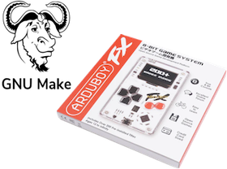
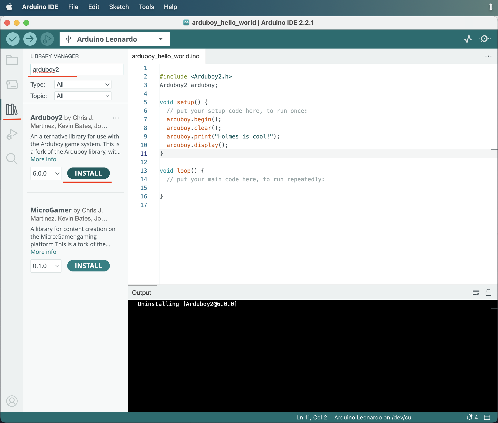
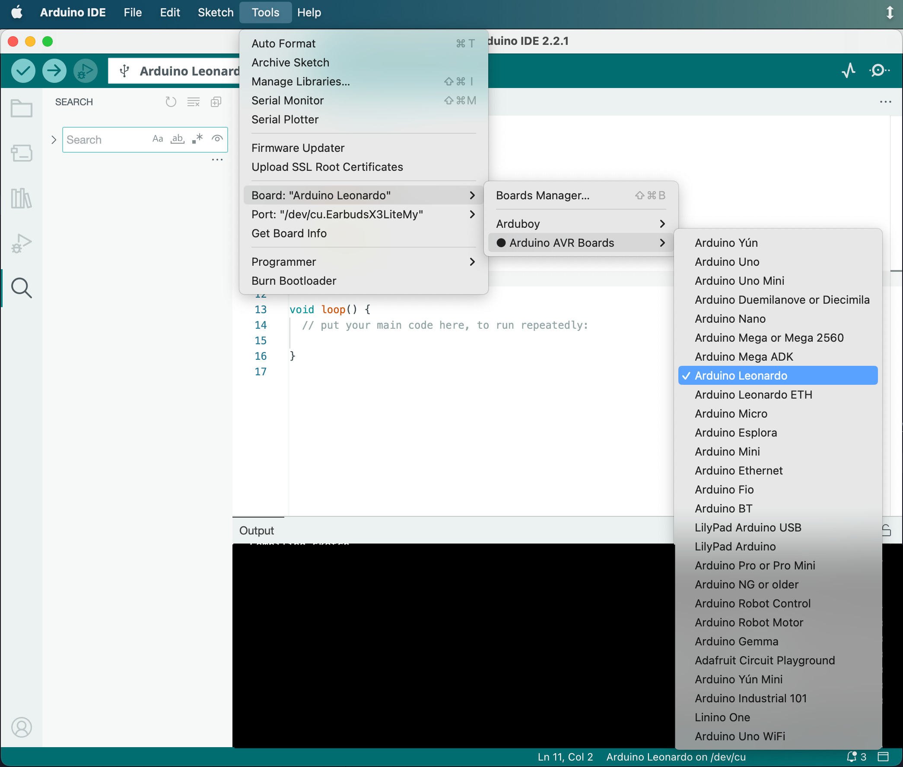
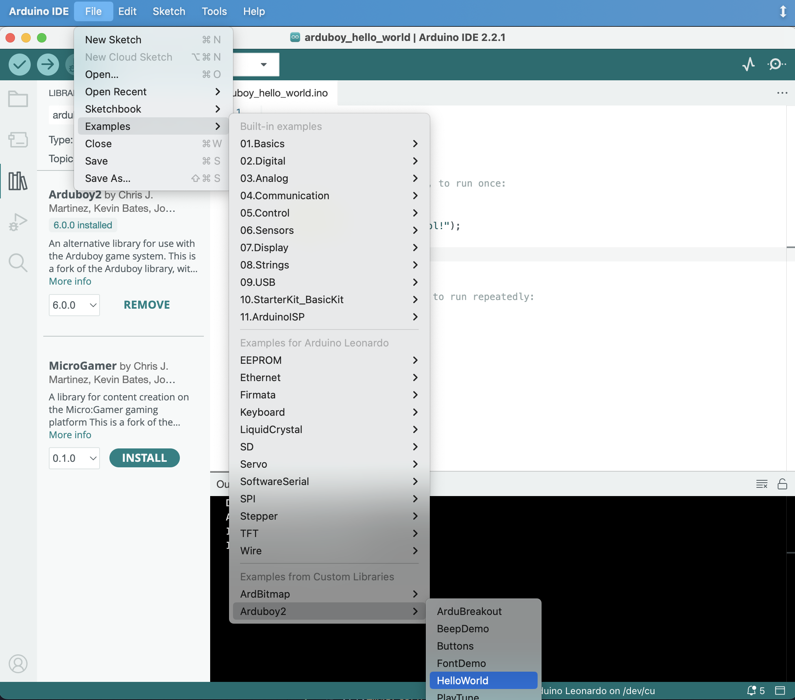
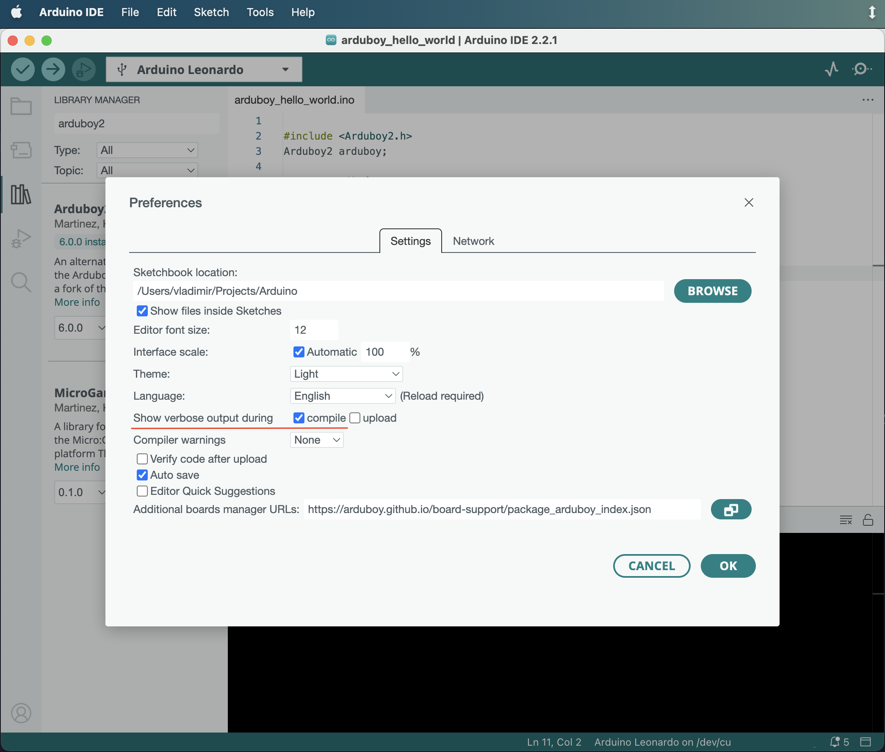
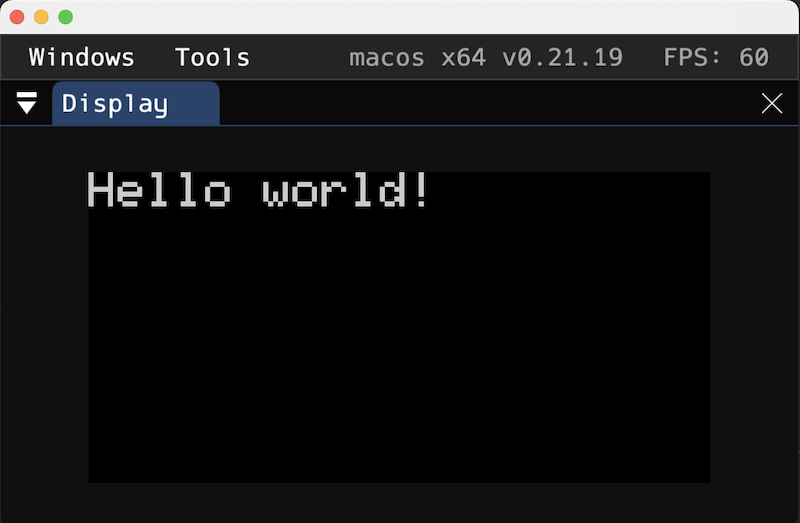

# How to build your project for Arduboy in pure C/C++ code



This repository has an example of how to build vanilla C/C++ project for Arduboy
with GNU Make.

## Contents

 - [Available make tasks](#available-make-tasks)
 - [Project structure](#project-structure)
 - [Used variables specific for dev machine](#used-variables-specific-for-dev-machine)
 - [Getting tools and dependencies with ArduinoIDE](#getting-tools-and-dependencies-with-arduinoide)
 - [Getting values for Makefile variables from the ArduinoIDE output](#getting-values-for-makefile-variables-from-the-arduinoide-output)
 - [Run tests on dev machine](#run-tests-on-dev-machine)
 - [Install Ardens emulator](#install-ardens-emulator)

## Available make tasks

The Makefile provides follow tasks:

 - `make clean` removes the output directory;
 - `make init` makes symbolic links from the external directories to the project;
 - `make arduino` rebuilds the Arduino core library;
 - `make arduboy2` rebuilds the Arduboy2 library;
 - `make compile_commands.json` creates a compilation database as a `compile_commands.json` file;
 - `make compile` compiles all project files; 
 - `make build` compiles all project files and builds the final \*.hex file;
 - `make test` run test on dev machine, if the `LOCAL_TEST` variable is specified;
 - `make emulate` runs project in ArdensPlayer, if the `ARDENS` variable is specified;
 - `make size` shows detailed information about the size of the binary files;
 - `make upload` to upload project to the board **NOT IMPLEMENTED YET**;
 - `make all` aggregates follow tasks: `clean`, `init`, `build`; This is _default_ task.
 - `make print-<VARIABLE>` prints a value of the <VARIABLE>;

## Project structure

The supposed structure of the project is:

```
│ # The directory with source files of your project.
│ # It can contains subdirectories.
├── src
│
│ # The directory with source files of your tests.
│ # It can contains subdirectories.
├── test
│
│ # The directory, where symbolic links to the libraries
│ # will be create during the `make init` command.
├── libs
│   ├── arduboy2 -> ...
│   ├── arduino -> ...
│   └── test_framework -> ...
│
│ # The directory with compilation results.
└── output
    │
    │ # The directory with binaries compiled for avr platform.
    ├── avr
    │   ├── libs
    │   │   ├── arduboy2
    │   │   └── arduino
    │   └── src
    │
    │ # The directory with binaries compiled for dev platform.
    └── dev
        ├── libs
        │   └── test_framework
        ├── src
        └── test
```

## Used variables specific for dev machine

To work with Makefile from this project you need:

  - avr tools (compiler, lincker, etc)
  - arduino libraries (core, hardware, etc)
  - extra libraries (Arduboy2, ArdBitmap, ArduboyPlaytune, etc)
  - test framework (optional)
  - emulator (optional). In this project the [Ardens](https://github.com/tiberiusbrown/Ardens) is used.

All variables, which have to be specified, are declared on the top of the [Makefile](Makefile)
in appropriate section.

To use the Makefile you have to set the next variables:

```make
# Path to the arduino installation:
ARDUINO_DIR=

# Path to the directory with already installed arduino libraries:
ARDUINO_LIBS_DIR=
```

To be able to run tests, or run your project in the emulator, you should also
provide follow variables:

```make
# If you want run tests on your machine, uncomment this line:
# LOCAL_TEST=true

# Path to the sources of a test library:
# TEST_FRAMEWORK_DIR=

# Path to the ArdensPlayer
# ARDENS=
```

Read more about compilers for tests here: [Run tests on dev machine](#run-tests-on-dev-machine).

About ArdensPlayer here: [Install Ardens emulator](#install-ardens-emulator).

Also, few variables with relative path are used. It may be reasonable to check
them to make more actual:

```make
# Path to the directory with avr binaries:
AVR_DIR=$(ARDUINO_DIR)/tools/avr-gcc/7.3.0-atmel3.6.1-arduino7

# Path to the directory with hardware libs:
ARDUINO_HARDWARE_DIR=$(ARDUINO_DIR)/hardware/avr/1.8.6

# Path to the directory with core lib sources:
ARDUINO_CORE_DIR=$(ARDUINO_HARDWARE_DIR)/cores/arduino

# Path to the directory with EEPROM lib sources:
ARDUINO_EEPROM=$(ARDUINO_HARDWARE_DIR)/libraries/EEPROM/src

# Path to the directory with Arduboy2 sources:
ARDUBOY2_DIR=$(ARDUINO_LIBS_DIR)/Arduboy2/src

# Compilers to build local tests:
GCC=gcc
GCPP=g++
```

Most of values for the Makefile's variables can be taken from the ArduinoIDE
installation. It's also possible to install everything in different ways:
install avr tools from the repo of your OS, download libraries manually from the
github, etc. But here we will look at getting everything except emulator and
test framework [from the ArduinoIDE installation](#getting-tools-and-dependencies-with-arduinoide).

## Getting tools and dependencies with ArduinoIDE

Follow instructions from the official web-site to install it: https://www.arduino.cc/en/software .

Install `Arduboy2` library:

`Tools ❱ Manage Libraries...`



## Getting values for Makefile variables from the ArduinoIDE output

Choose `Arduino Leonardo` as the board:

`Tools ❱ Board ❱ Arduino AVR Boards ❱ Arduino Leonardo`



Open any example for Arduboy:

`Files ❱ Examples ❱ Arduboy2 ❱ HelloWorld`



Turn on additional logs:

`Settings... ❱ Settings ❱ Show verbose output during ❱  compile`



Now, if you run verification of the example, you become able to take many needed paths
from the log:

```sh
FQBN: arduino:avr:leonardo
Using board 'leonardo' from platform in folder: /Users/dokwork/Library/Arduino15/packages/arduino/hardware/avr/1.8.6
Using core 'arduino' from platform in folder: /Users/dokwork/Library/Arduino15/packages/arduino/hardware/avr/1.8.6

Detecting libraries used...
/Users/dokwork/Library/Arduino15/packages/arduino/tools/avr-gcc/7.3.0-atmel3.6.1-arduino7/bin/avr-g++ ...
Alternatives for Arduboy2.h: [Arduboy2@6.0.0]
ResolveLibrary(Arduboy2.h)
  -> candidates: [Arduboy2@6.0.0]
...
Using library Arduboy2 at version 6.0.0 in folder: /Users/dokwork/Projects/Arduino/libraries/Arduboy2 
Using library EEPROM at version 2.0 in folder: /Users/dokwork/Library/Arduino15/packages/arduino/hardware/avr/1.8.6/libraries/EEPROM 
...
```

Here we can find follow paths:

```make
ARDUINO_DIR=/Users/dokwork/Library/Arduino15/packages/arduino
AVR_DIR=$(ARDUINO_DIR)/tools/avr-gcc/7.3.0-atmel3.6.1-arduino7
ARDUINO_HARDWARE_DIR=/Users/dokwork/Library/Arduino15/packages/arduino/hardware/avr/1.8.6
ARDUINO_LIBS_DIR=/Users/dokwork/Projects/Arduino/libraries
```

## Run tests on dev machine

Sometimes, it may be reasonable to run tests on the developer machine. You may
separate a part of the logic of your game from the platform specifics and test
it locally. To do so, the tests and the code, which are need to be tested, should
not depend on Arduino at all. 

The target `test` of the Makefile from this project is able to find a sources,
which should be recompiled for local tests. That sources will be recompile for
the dev platform, and link together with tests and test framework sources, and
then run.

To be able to run test you should define the `LOCAL_TEST` variable. 

Also, you may use some test framework. Set the path to its sources
to the `TEST_FRAMEWORK_DIR` variable:

```sh
# Example:
TEST_FRAMEWORK_DIR=$(HOME)/Projects/Unity
```

By default, the tests and test framework sources will be compiled by the `gcc`
and/or `g++` compilers. To change them, or provide the full path to their
binaries, replace the `GCC` and `GCPP` variables.

## Install Ardens emulator

To install the ArdensPlayer you may take appropriate asset from the
[releases page](https://github.com/tiberiusbrown/Ardens/releases),
or read [docs](https://github.com/tiberiusbrown/Ardens) to follow another way.

When the ArdensPlayer has been installed, set the path to the directory with its
binaries in the Makefile:

```sh
# Example:
ARDENS=$(HOME)/Arduino/Ardens/ArdensPlayer
```


