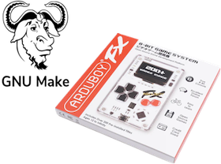
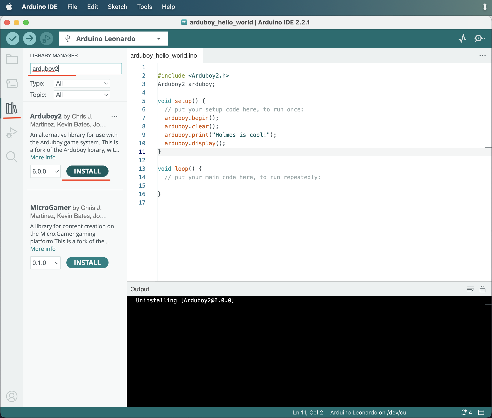
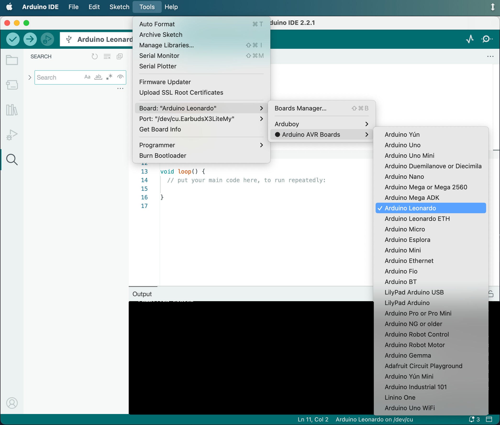
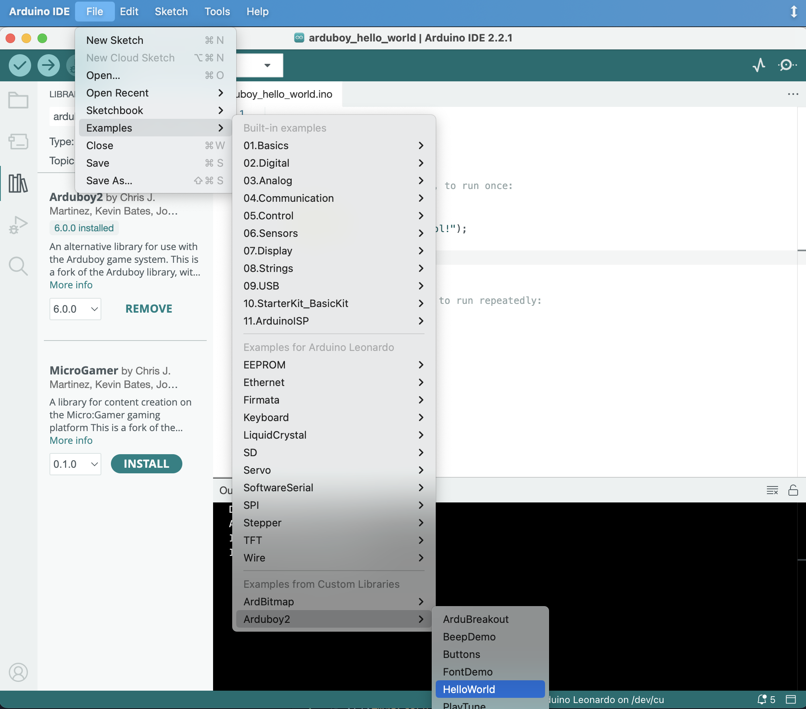

# How to build your project for Arduboy in pure C/C++ code



This repository has an example of how to build vanilla C/C++ project for Arduboy
with GNU Make.

## Set user specific variables

To work with Makefile from this project you need:

  - avr tools (compiler, lincker, etc)
  - arduino libraries (core, hardware, etc)
  - extra libraries (Arduboy2, ArdBitmap, ArduboyPlaytune, etc)
  - emulator, if you want (in this project the [Ardens](https://github.com/tiberiusbrown/Ardens) is used)

Most of them can be taken from the ArduinoIDE installation. It's also
possible to install everything in different ways: install avr tools from the
repo of your OS, download libraries manually from the github, etc. But here we
will look at getting everything except emulator from the ArduinoIDE
installation.

## Get tools and dependencies from the ArduinoIDE

Follow instructions from the official web-site to install it: https://www.arduino.cc/en/software .

Install `Arduboy2` library:

`Tools ❱ Manage Libraries...`



Choose `Arduino Leonardo` as the board:

`Tools ❱ Board ❱ Arduino AVR Boards ❱ Arduino Leonardo`



Turn on additional logs:

`Settings... ❱ Settings ❱ Show verbose output during ❱  compile`


Open any example for Arduboy:

`Files ❱ Examples ❱ Arduboy2 ❱ HelloWorld`



## Set variables in the Makefile

To use the Makefile you have to set the next variables:

```make
# Path to the arduino installation:
ARDUINO_DIR=

# Path to the directory with avr binaries:
AVR_DIR=

# Path to the directory with hardware libs:
ARDUINO_HARDWARE_DIR=

# Path to the directory with already installed arduino libraries:
LIBS_DIR=
```

If you run verification of the example, you may take many needed paths
from the log:

```sh
FQBN: arduino:avr:leonardo
Using board 'leonardo' from platform in folder: /Users/vladimir/Library/Arduino15/packages/arduino/hardware/avr/1.8.6
Using core 'arduino' from platform in folder: /Users/vladimir/Library/Arduino15/packages/arduino/hardware/avr/1.8.6

Detecting libraries used...
/Users/vladimir/Library/Arduino15/packages/arduino/tools/avr-gcc/7.3.0-atmel3.6.1-arduino7/bin/avr-g++ ...
Alternatives for Arduboy2.h: [Arduboy2@6.0.0]
ResolveLibrary(Arduboy2.h)
  -> candidates: [Arduboy2@6.0.0]
...
Using library Arduboy2 at version 6.0.0 in folder: /Users/vladimir/Projects/Arduino/libraries/Arduboy2 
Using library EEPROM at version 2.0 in folder: /Users/vladimir/Library/Arduino15/packages/arduino/hardware/avr/1.8.6/libraries/EEPROM 
...
```

Here we can find follow paths:

```make
ARDUINO_DIR=/Users/vladimir/Library/Arduino15/packages/arduino
AVR_DIR=$(ARDUINO_DIR)/tools/avr-gcc/7.3.0-atmel3.6.1-arduino7/bin
ARDUINO_HARDWARE_DIR=/Users/vladimir/Library/Arduino15/packages/arduino/hardware/avr/1.8.6
LIBS_DIR=/Users/vladimir/Projects/Arduino/libraries
```

## Install Ardens emulator

To install ArdensPlayer you may take appropriate asset from the [releases page](https://github.com/tiberiusbrown/Ardens/releases),
or read [docs](https://github.com/tiberiusbrown/Ardens) to follow another way.

When ArdensPlayer has been installed, set the path to the directory with its
binaries in the Makefile:

```sh
ARDENS=$(HOME)/Arduino/Ardens/ArdensPlayer
```

## Available make tasks

The Makefile provides follow tasks:

 - `make clean` to remove output directory
 - `make core` to build Arduino core library
 - `make arduboy2` to build Arduboy2 library. It depends on the `core` task.
 - `make compile` to whole project as a single binary file. 
 - `make hex` to create \*.hex file
 - `make run` to run project in ArdensPlayer
 - `make upload` to upload project to the board **NOT IMPLEMENTED YET**

